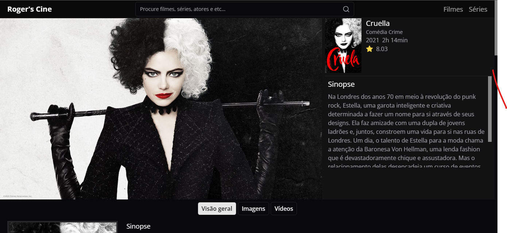

# Roger's cine

<a href="https://roger-cines.netlify.app/#/" target="__blank">Clique aqui para acessar o projeto</a>

Este projeto consome a API do *TMDb* para exibir informações sobre filmes. Foi desenvolvido com as seguintes tecnologias:

- *React* e *React Query* para a interface do usuário e gerenciamento de estado.
- *Tailwind CSS* para estilização rápida e responsiva.
- *TypeScript* para tipagem estática.
- *Shadcn UI* (assumindo que seja uma biblioteca fictícia) para componentes personalizados.

## Configuração

1. Clone este repositório.
2. Instale as dependências com npm install.
3. Crie um arquivo .env na raiz do projeto e adicione sua chave de API do TMDb:

VITE_API_KEY=SUA_CHAVE_AQUI

